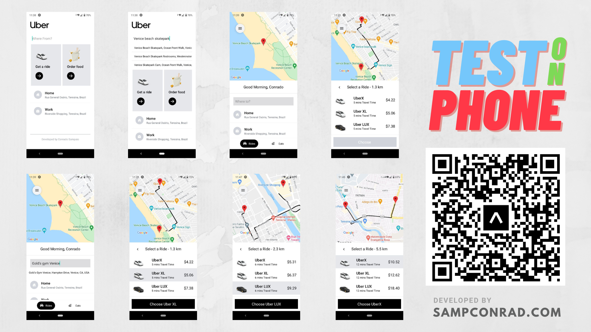

# Uber-clone

Demo: https://expo.dev/@sampconrad/uber-clone

## About

Uber Clone app built on React Native using the [Google Distance Matrix API](https://developers.google.com/maps/documentation/distance-matrix) to calculate milage, travel time, and estimate pricing for the ride, the [Google Places API](https://developers.google.com/maps/documentation/places/web-service/) for the auto-complete functionality when typing, and the [Google Directions API](https://developers.google.com/maps/documentation/directions) & [Google Maps JS API](https://developers.google.com/maps/documentation/javascript) to get a functional map that traces directions from point A to B.

